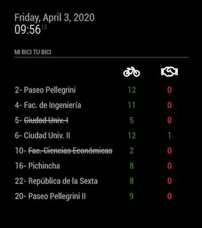

# MMM-MiBiciTuBici
A [MagicMirror²](https://magicmirror.builders) helper module to get how many public bikes are currently available at your favorites stations in Rosario, Argentina.

[](https://raw.githubusercontent.com/bibaldo/MMM-MiBiciTuBici/master/LICENSE)



## Installation

In your terminal, go to your MagicMirror's Module folder:
````
cd ~/MagicMirror/modules
````

Clone this repository:
````
git clone https://github.com/bibaldo/MMM-MiBiciTuBici.git
````

Add the module to the modules array in the `config/config.js` file:
````javascript
  {
    module: "MMM-MiBiciTuBici"
  },
````

## Configuration options

The following properties can be configured:

| Option                       | Description
| ---------------------------- | -----------
| `header`                     | The header text <br><br> **Default value:** `'Mi Bici Tu Bici'`
| `stationsList`               | The stations (ids) that we want to get live info <br> You can get the ID's from https://www.mibicitubici.gob.ar <br><br> **Possible value:** `[ 1, 4, 6 ]` <br> **Default value:** `[ 2, 4, 5, 6, 10, 16, 20, 22 ]`
| `infoClass`                  | The font size of data <br><br> **Possible values:** `'small'`, `'medium'`, `'big'` <br> **Default value:** `'medium'`
| `updateInterval`             | How often does the content needs to be fetched? (Milliseconds) <br><br> **Possible values:** `1000` - `86400000` <br> **Default value:** `300000` (5 minutes)
| `fadeSpeed`      | Speed of the update animation. (Milliseconds) <br><br> **Possible values:**`0` - `5000` <br> **Default value:** `4000` (4 seconds)

## Config Example

````javascript
  {
    module: "MMM-MiBiciTuBici",
    position: "top_left",
    config: {
      header: 'Mi Bici Tu Bici',
      stationsList: [2, 4, 5, 6],
      updateInterval: 300000,
      infoClass: 'medium'
    }
  },
````

## Updating

To update the module to the latest version, use your terminal to go to your MMM-MiBiciTuBici module folder and type the following command:

````
git pull
```` 

Feel free to open any Issue :smiley: